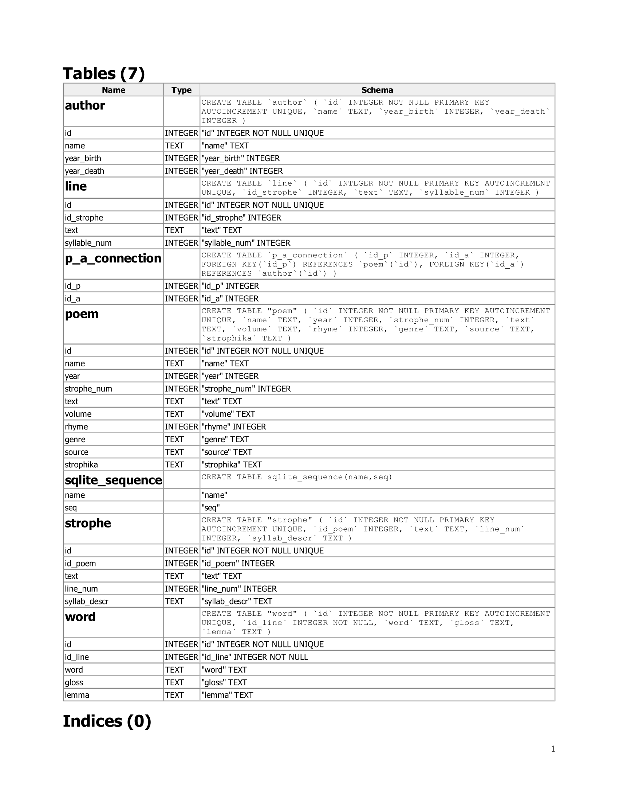

# swedish_poetry
Poetic Corpus for Swedish Language

## Database

Current corpus is in an SQLite database that can be viewed with, for example, [DB Browser for SQLite](https://sqlitebrowser.org/).

Database has following schema:

Corpus has texts from three swedish authors:
* Karin Boye, volumes:
  * MOLN
  * GÖMDA LAND
  * HÄRDARNA
  * FÖR TRÄDETS SKULL
  * DE SJU DÖDSSYNDERNA
* Nils Ferlin, volumes:
  * GOGGLES 
  * BARFOTABARN
  * FRÅN MITT EKORRHJUL
  * EN DÖDDANSARES VISOR
  * KEJSARENS PAPEGOJA
  * MED MÅNGA KULÖRTA LYKTOR
* Esaias Tegnér, volumes:
  * MINDRE DIKTER
  * FRITHIOFS SAGA
    

## Source code

Available source code by file:
* get_texts_boye.py:
  * Crawl http://www.karinboye.se/verk/dikter/dikter/ to save poems as .txt files.
  * List of poems to collect is in dikt.txt
* get_texts_tegner.py:
  * Crawl https://svenskadikter.com/ to collect texts of Frithiofs saga in JSON format to the output file tegner_frithiofs_saga_source_text.json.
  * List of poems to collect is in file tegner_saga.txt
* count_strofika.py:
  * Split poems in stanzas.
  * Split poems into individual lines.
  * Determine whether stanza pattern is regular vs. irregular.
  * Update number of syllables per line.
* count_syllabs.py:
  * Insert poems into DB.
  * Create connection between poem and author.
  * Split poems into stanzas and lines.
* add_words.py:
  * Add individual words from each poem to the database table **word**, including its gloss, lemma and line id it came from. 
  * [Stagger](https://www.ling.su.se/english/nlp/tools/stagger) was used to obtain words' glosses and lemmas.
  
Some code (DB creation, determining genre, getting Ferlin's texts) has been lost, most of the other code I wouldn't recommend using as is.
It would require significant refactoring for any future use and to adhere to better coding practices.